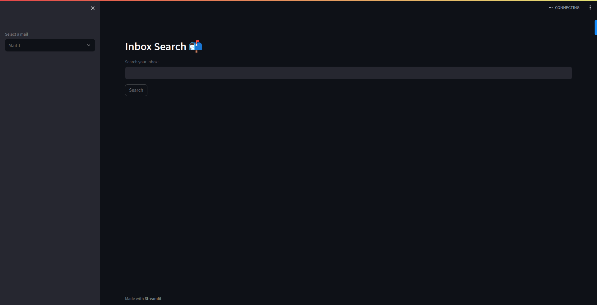

# DataSeekr: Personal Data Search Engine

DataSeekr is a powerful search engine application designed to help you efficiently search and explore your personal data, specifically focusing on Gmail. This application utilizes the Weaviate vector database for advanced search capabilities and Streamlit for the user-friendly front-end interface.



## Key Features

- Seamlessly search and navigate through your Gmail data.
- Leverage the power of Weaviate's vector-based search technology for accurate and fast results.
- User-friendly Streamlit interface for an intuitive and enjoyable user experience.

## Integrating Gmail API and Loading Mails

To fetch and load your Gmail data into DataSeekr, follow these steps:

1. Follow the tutorial at <a href="https://www.geeksforgeeks.org/how-to-read-emails-from-gmail-using-gmail-api-in-python/">How to Read Emails from Gmail Using Gmail API in Python</a> to set up Gmail API access and obtain your <code>credentials.json</code> file.

2. Place the credentials.json file in the root directory of this repository.

3. Make sure you have Docker installed. If not, download and install it from Docker's official website.

4. Start the database by running the following command in the root directory:

```bash
docker-compose up -d --build 
```

5. Run the script to load your mails into the vector database:

```bash
python databases/load_mails_to_db_V1.py
```

6. To check if the loading is successful, you can run another script:

```bash
python databases/get_all.py
```

Now your Gmail data should be successfully loaded into the vector database, and you can use DataSeekr to search and explore your emails.

## Getting Started

Follow these steps to set up and run DataSeekr locally on your machine:

1. Clone this repository:

```bash
git clone git@github.com:Jatin-tec/DataSeekr.git
```

2. Create and activate a new conda environment:

```bash
conda create -n dataseekr python=3.8
conda activate dataseekr
```

3. Install the required dependencies using the requirements.txt file:

```bash
conda install --file requirements.txt
```

4. Launch the database by running the following command in the root directory:

```bash
docker-compose up
```

5. Launch the DataSeekr application:

```bash
streamlit run app.py
```

6. Open your web browser and navigate to `http://localhost:8501` to access DataSeekr.

---
Happy data searching with DataSeekr!
---