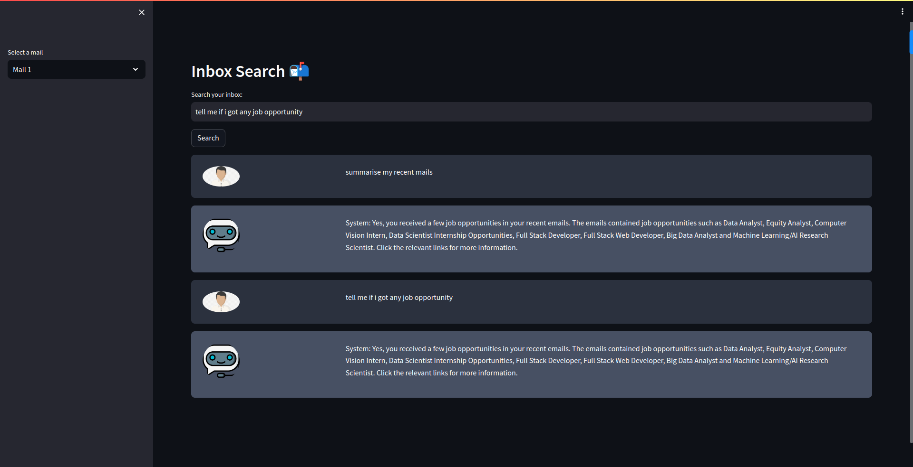

# DataSeekr: Personal Data Search Engine

DataSeekr is a powerful search engine application designed to help you efficiently search and explore your personal data, specifically focusing on Gmail. This application utilizes the Weaviate vector database for advanced search capabilities and Streamlit for the user-friendly front-end interface.



## Key Features

- Seamlessly search and navigate through your Gmail data.
- Leverage the power of Weaviate's vector-based search technology for accurate and fast results.
- User-friendly Streamlit interface for an intuitive and enjoyable user experience.

## Getting Started

Follow these steps to set up and run DataSeekr locally on your machine:

1. Clone this repository:

```bash
git clone git@github.com:Jatin-tec/DataSeekr.git
```

2. Create and activate a new conda environment:

```bash
conda create -n dataseekr python=3.8
conda activate dataseekr
```

3. Install the required dependencies using the requirements.txt file:

```bash
conda install --file requirements.txt
```

4. Launch the DataSeekr application:

```bash
streamlit run app.py
```

5. Open your web browser and navigate to `http://localhost:8501` to access DataSeekr.

---
Happy data searching with DataSeekr!
---